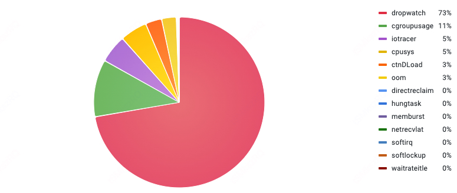
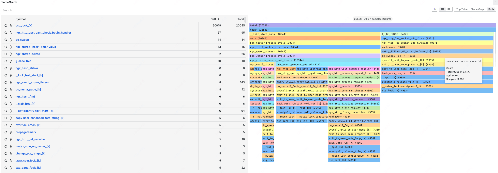

简体中文 | [English](./README_EN.md)

# 什么是 HUATUO
**HUATUO（华佗）**是由**滴滴**开源并依托 **CCF 开源发展委员会**孵化的云原生操作系统可观测性项目，专注于为复杂云原生环境提供操作系统内核级深度观测能力。该项目基于 [eBPF](https://docs.kernel.org/userspace-api/ebpf/syscall.html) 技术，通过整合 [kprobe](https://www.kernel.org/doc/html/latest/trace/kprobes.html)、 [tracepoint](https://www.kernel.org/doc/html/latest/trace/tracepoints.html)、 [ftrace](https://www.kernel.org/doc/html/latest/trace/ftrace.html)  等内核动态追踪技术，实现了多维度的内核观测能力：**1.** 更精细化的内核子系统埋点指标 Metric **2.** 异常事件驱动的内核运行时上下文捕获 Events **3.** 针对系统突发毛刺的自动追踪 AutoTracing、AutoProfiling。该项目逐步构建了完整的 Linux 内核深度可观测体系架构。目前，HUATUO 已在滴滴生产环境中实现规模化部署，在诸多故障场景中发挥关键作用，有效保障了云原生操作系统的高可用性和性能优化。通过持续的技术演进，希望 HUATUO 能够推动 eBPF 技术在云原生可观测领域向更细粒度、更低开销、更高时效性的方向发展。


# 核心特性
- **低损耗内核全景观测**：基于 BPF 技术，保持性能损耗小于1%的基准水位，实现对内存管理、CPU 调度、网络及块 IO 子系统等核心模块的精细化、全维度、全景观测与性能剖析。通过自适应采样机制，实现系统资源损耗与观测精度的动态平衡。
- **异常事件驱动诊断**：构建基于异常事件驱动的运行时上下文捕获机制，聚焦内核异常与慢速路径的精准埋点。当发生缺页异常、调度延迟、锁竞争等关键事件时，自动触发调用链追踪，生成包含寄存器状态、堆栈轨迹及资源占用的图谱诊断信息。
- **全自动化追踪 AutoTracing**：AutoTracing 模块采用启发式追踪算法，解决云原生复杂场景下的典型性能毛刺故障。针对 CPU idle 掉底，CPU sys 突增，IO 突增，loadavg 突增等棘手问题，实现自动化快照留存机制和根因分析。
- **持续性能剖析 Profiling**：持续对操作系统内核，应用程序进行全方位性能剖析，涉及系统 CPU、内存、I/O、 锁、以及各种解释性编程语言，力助业务持续的优化迭代更新。该功能在哨兵压测，防火演练，重要节假日护堤等场景发挥关键作用。
- **分布式链路追踪 Tracing**：以网络为中心的面向服务请求的分布式链路追踪，能够清晰的划分系统调用层级关系，节点关联关系，耗时记账等，支持在大规模分布式系统中的跨节点追踪，提供微服务调用的全景视图，保障系统在复杂场景下的稳定性。
- **开源技术生态融合**：无缝对接主流开源可观测技术栈，如 Prometheus、Grafana、Pyroscope、Elasticsearch等。支持独立物理机和云原生部署，自动感知 K8S 容器资源/标签/注解，自动关联操作系统内核事件指标，消除数据孤岛。通过零侵扰、内核可编程方式兼容主流硬件平台和内核版本，确保其适应性、应用性。

# 快速上手

- **极速体验**
如果你只关心底层原理，不关心存储、前端展示等，我们提供了编译好的镜像，已包含 HUATUO 底层运行的必要组件，直接运行即可：
    ```bash
    $ docker run --privileged --network=host -v /sys:/sys -v /run:/run huatuo/huatuo-bamai:latest
    ```

- **快速搭建**
如果你想更进一步了解 HUATUO 运行机制，架构设计等，可在本地很方便地搭建 HUATUO 完整运行的所有组件，我们提供容器镜像以及简单配置，方便用户开发者快速了解 HUATUO。
    ```mermaid
    flowchart LR
        subgraph host
            subgraph huatuo-bamai
                A1[【metrics】] <-- "transfer" --> A2[【tracing】]
            end
        end

        subgraph storage backends
        A1 -->|:19704| B1[prometheus]
        A2 -->|:9200| B2[elasticsearch]
        end
        
        subgraph grafana_dashboard["grafana panels"]
        B1 -->|:9090| C1[host, container]
        B2 -->|:9200| C2[autotracing, events]
        end
        
        subgraph browser
        D[:3000]
        end
        
        C1 --> D
        C2 --> D
    ```
    <div style="text-align: center; margin: 8px 0 20px 0; color: #777;">
    <small>
    HUATUO 组件运行示意<br>
    </small>
    </div>

    为快速搭建运行环境，我们提供一键运行的方式，该命令会启动 elasticsearch, prometheus, grafana 以及 huatuo-bamai 组件。命令执行成功后，打开浏览器访问 http://localhost:3000 即可浏览监控大盘。

    ```bash
    $ docker compose --project-directory ./build/docker up
    ```

# 软件架构


# 功能列表
## Autotracing
| 追踪名称        | 核心功能               | 场景                                   |
| ---------------| --------------------- |-------------------------------------- |
| cpu sys        | 宿主 sys 增高检测       | 由于系统负载异常导致业务毛刺问题            |
| cpu idle       | 容器 cpu idle 掉底检测，提供调用栈，火焰图，进程上下文信息等 | 容器 cpu 使用异常，帮助业务判断进程热点是否异常 |
| dload          | 跟踪 D 状态进程，提供容器运行情况、D 状态进程调用栈信息等 | 由于系统 D 或 R 状态进程数量突增导致负载升高的问题。系统 D 状态突增通常和资源不可用或者锁被长期持有相关，R 状态进程数量突增往往是业务代码设计不合理导致 |
| waitrate       | 容器 cpu 外部争抢检测，提供发生争抢时的容器信息等 | 容器 cpu 争抢可能会引起业务毛刺，已存在争抢指标缺乏具体争抢容器信息，通过 waitrate 追踪可以获取参与争抢的容器信息，给混部资源隔离提供参考 |
| memburst       | 记录突发内存分配上下文 | 宿主机短时间内大量分配内存时，检测宿主机上短时间内大量分配内存的事件，突发性内存分配可能引发直接回收或者 oom 等 |
| iotracer       | 检测宿主磁盘满、IO 延迟异常时，输出异常时 IO 访问的文件名和路径、磁盘设备、inode 号、容器等上下文信息 | 频繁出现磁盘 IO 带宽打满、磁盘访问突增，进而导致应用请求延迟或者系统性能抖动 |

## Events
| 事件名称        | 核心功能               | 场景                                    |
| ---------------| --------------------- |----------------------------------------|
| softirq        | 宿主软中断延迟响应或长期关闭，输出长时间关闭软中断的调用栈，进程信息等 | 该类问题会严重影响网络收发，进而导致业务毛刺或者超时等其他问题 |
| dropwatch      | TCP 数据包丢包检测，输出发生丢包时主机、网络上下文信息等 | 该类问题主要会引起业务毛刺和延迟 |
| netrecvlat     | 在网络收方向获取数据包从驱动、协议栈、到用户主动收过程的延迟事件 | 网络延迟问题中有一类是数据传输阶段收方向存在延迟，但不清楚是延迟位置，netrecvlat case 根据 skb 入网卡时间戳依次在驱动、协议栈和用户 copy 数据的路径计算延迟，通过预先设定的阈值过滤超时的数据包，已定位延迟位置 |
| oom            | 检测宿主或容器内 oom 事件 | 当宿主机层面或者容器维度发生 oom 事件时，能够获取触发 oom 的进程信息、被 kill 的进程信息以及容器信息，便于定位进程内存泄漏、异常退出等问题 |
| softlockup     | 当系统上发生 softlockup 时，收集目标进程信息以及 cpu 信息，同时获取各个 cpu 上的内核栈信息 | 系统发生 softlockup |
| hungtask       | 提供系统内所有 D 状态进程数量、内核栈信息 | 用于定位瞬时出现 D 进程的场景，能及时保留现场便于后期问题跟踪 |
| memreclaim     | 进程进入直接回收的耗时，超过时间阈值，记录进程信息 | 内存压力过大时，如果此时进程申请内存，有可能进入直接回收，此时处于同步回收阶段，可能会造成业务进程的卡顿，此时记录进程进入直接回收的时间，有助于我们判断此进程被直接回收影响的剧烈程度 |

## Metrics
metrics 采集包括各子系统的众多指标，包括 cpu, memory, io, network 等，metrics 主要来源 procfs, eBPF, 计算聚合等，以下为部分 Metrics 的简介。[详细参考](docs/metrics.md)

| 子系统       | Metric          | 描述                                 | 维度               |
| ----------- | --------------- | ----------------------------------- | ------------------ |
| cpu         | sys, usr, util  | cpu 占用百分比                        | 宿主、容器          |
| cpu         | burst, throttled | cpu burst 时长, throttled/limited 的次数 | 容器           |
| cpu         | inner, exter_wait_rate | 容器内外部争抢指数              | 容器               |
| cpu         | nr_running, nr_uninterruptible | 对应状态的任务数        | 容器               |
| cpu         | load 1, 5, 15   | 宿主的 1、5、15 分钟平滑负载值          | 宿主               |
| cpu         | softirq_latency | NET_RX/NET_TX 中断延迟在指定区间内的次数 | 宿主               |
| cpu         | runqlat_nlat    | 调度延迟在指定时间段内的出现的次数        |  宿主、容器         |
| cpu         | reschedipi_oversell_probability | VM 宿主机可能发生 cpu 超卖 | 宿主           |
| memory      | direct_reclaim  | 内存直接回收相关指标                    | 容器               |
| memory      | asyncreclaim    | 内存异步回收相关指标                    | 容器               |
| memory      | vmstat, memory_stat | 其他内存状态指标                   | 宿主、容器          |
| memory      | hungtask, oom, softlockup | 事件计数统计                | 宿主、容器          |
| IO          | d2c             | 统计 IO 的延迟，只包括驱动和磁盘硬件处理部分 | 宿主、容器        |
| IO          | q2c             | 统计 IO 的延迟，包括整个 IO 生命周期     | 宿主、容器          |
| IO          | disk_freeze     | 统计磁盘 freeze 的事件次数             | 宿主               |
| IO          | disk_flush      | 统计 RAI 设备的 flush 操作延迟         | 宿主、容器          |
| network     | arp             | ARP 缓存数量                         | 系统、宿主、容器      |
| network     | tcp, udp mem    | Socket 使用、socket 内存使用等        | 系统、宿主、容器      |
| network     | qdisc           | 网络出向队列状态统计                   | 宿主                |
| network     | netdev          | 设备指标统计                          | 宿主、容器           |
| network     | netstat         | 网络指标统计                          | 宿主、容器           |
| network     | sockstat        | Socket 指标统计                      | 宿主、容器           |


# 前端展示
## 机房内核事件总览


## AutoProfiling

## Dropwatch

##  net_rx_latency


# 联系我们
@[hao022](https://github.com/hao022)
@[nashuiliang](https://github.com/nashuiliang)