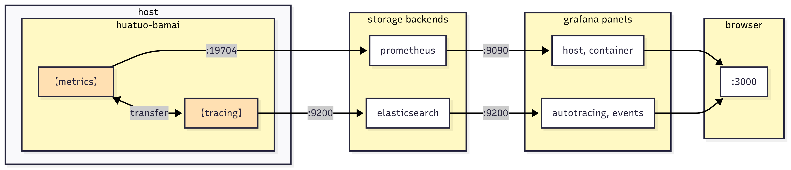
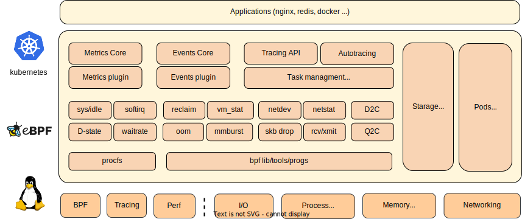
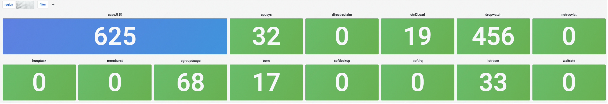
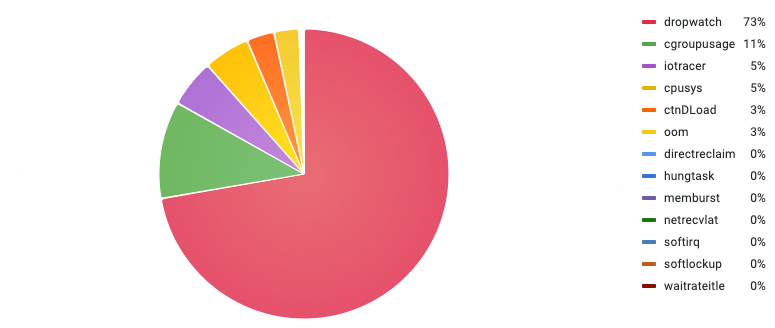
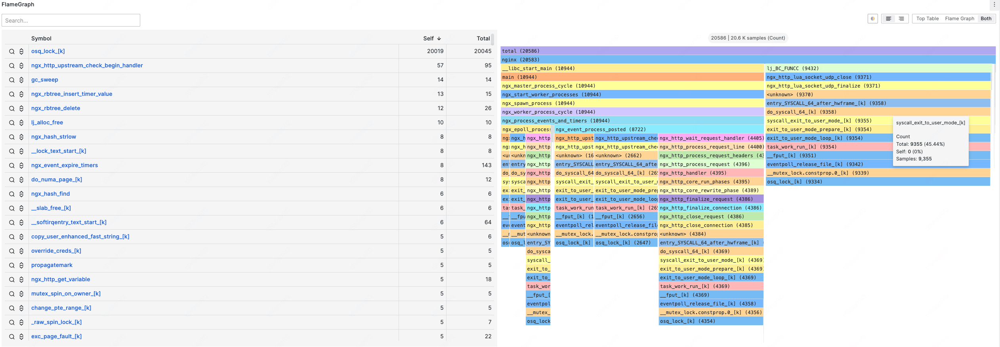
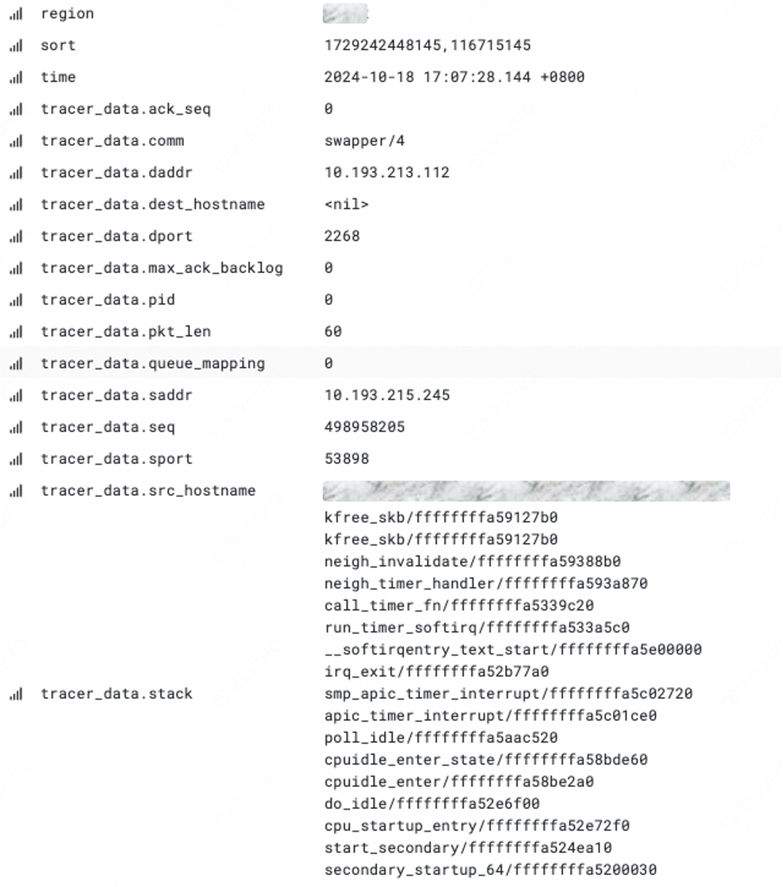
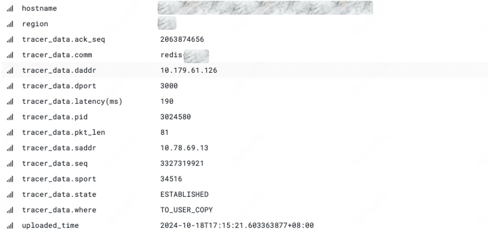

[简体中文](./README_CN.md) | English

# Abstract
**HuaTuo (华佗)** aims to provide in-depth observability for the OS Linux kernel in complex **cloud-native** scenarios. The project is based on [eBPF](https://docs.kernel.org/userspace-api/ebpf/syscall.html) technology and has built a set of deep observation service components for the Linux kernel. By leveraging kernel dynamic tracing technologies such as [kprobe](https://www.kernel.org/doc/html/latest/trace/kprobes.html), [tracepoint](https://www.kernel.org/doc/html/latest/trace/tracepoints.html), and [ftrace](https://www.kernel.org/doc/html/latest/trace/ftrace.html), HuaTuo provides more observation perspectives for the Linux kernel, including kernel runtime context capture driven by anomalous events and more granular, accurate kernel per subsystem metrics.

HuaTuo also integrates core technologies such as automated tracing, profiling, and distributed tracing for system performance spikes. HuaTuo has been successfully applied on a large scale within Didi (DiDi Global Inc.), solidly guaranteeing the stability and performance optimization of cloud-native operating systems and showcasing the distinct advantages of eBPF technology in cloud-native scenarios.

# Key Features
- **Continuous** Kernel Observability: Achieves in-depth, low-overhead (less than 1% performance impact) instrumentation of various kernel subsystems, providing comprehensive metrics on memory, CPU scheduling, network stack, and disk I/O.
- Kernel **Anomaly-Driven** Observability: Instruments the kernel's exception paths and slow paths to capture rich runtime context triggered by anomalous events, enabling more insightful observability data.
- **Automated** Tracing (AutoTracing): Implements automated tracing capabilities to address system resource spikes and performance jitters (e.g., CPU idle drop, raising CPU sys utilization, I/O bursts, and Loadavg raising).
- **Smooth Transition** to Popular Observability Stacks: Provides standard data sources for Prometheus and Pyroscope, integrates with Kubernetes container resources, and automatically correlates Kubernetes labels/annotations with kernel event metrics, eliminating data silos, ensuring seamless integration and analysis across various data sources for comprehensive system monitoring.

# Getting Started
- **​Instant Experience​**
If you only care about the underlying principles and not about storage backends or frontend display, we provide a pre-built image containing all necessary components for HUATO's core operation. Just run:

    ```bash
    $ docker run --privileged --cgroupns=host --network=host -v /sys:/sys -v /run:/run huatuo/huatuo-bamai:latest
    ```

- **Quick Setup​**
If you want to dive deeper into HUATO's operation mechanisms and architecture, you can easily set up all components locally. We provide container images and simple configurations for developers to quickly understand HUATO.
    
    <div style="text-align: center; margin: 8px 0 20px 0; color: #777;">
    <small>
    HUATUO Component Workflow<br>
    </small>
    </div>

    For a quick setup, we provide a one-command solution to launch [elasticsearch](https://www.elastic.co), [prometheus](https://prometheus.io), [grafana](https://grafana.com) and huatuo-bamai. Once executed, click [http://localhost:3000](http://localhost:3000)​ to view the monitoring dashboards on your browser.

- Data related to event-driven operations Autotracing and Events, are stored in elasticsearch
- Metrics-related data is actively collected and stored by prometheus
- elasticsearch data reporting port: 9200
- prometheus data source port: 9090
- grafana port: 3000

## User-Defined Collection
The built-in modules cover most monitoring needs. Additionally, HuaTuo supports custom data collection with easy integration. [How to Add Custom Collection](./docs/CUSTOM.md)

# Architectures


# Observability Overview
## Exception Totals


## Profiling

## SKB dropwatch

##  Net Latency


# Functionality Overview
## Autotracing
| Tracing Name | Core Functionality      | Scenarios                            |
| ------------ | ----------------------- | ------------------------------------ |
| cpu sys      | Detects rising host cpu.sys utilization | Issues caused by abnormal cpu.sys load leading to jitters |
| cpu idle     | Detects low CPU idle in containers, provides call stack, flame graphs, process context info, etc. | Abnormal container CPU usage, helps identify process hotspots |
| dload        | Tracks processes in the D (uninterruptible) state, provides container runtime info, D-state process call stack, etc. | Issues caused by a sudden increase in the number of system D or R (runnable) state processes, leading to higher load. A spike in D-state processes is often related to unavailable resources or long-held locks, while R-state process spikes may indicate unreasonable user logic design |
| waitrate     | Detects CPU contention in containers, provides information about the contending containers | CPU contention in containers can cause jitters, and the existing contention metrics lack specific container info. Waitrate tracking can provide the info about the containers involved in the contention, which can be used as a reference for resource isolation in hybrid deployment scenarios |
| mmburst      | Records burst memory allocation context | Detects events where the host allocates a large amount of memory in a short time, which can lead to direct reclaim or OOM |
| iotracer     | When the host disk is full or I/O latency is abnormal, provides the file name, path, device, inode, and container context info for the abnormal I/O access | Frequent disk I/O bandwidth saturation or sudden I/O spikes can lead to application request latency or system performance jitters |

## Events
| Event Name     | Core Functionality    | Scenarios                            |
| -------------- | --------------------- | ------------------------------------ |
| softirq        | When the kernel delayed response in soft interrupts or prolonged shutdown, supports the call stack and process information of the soft interrupts that have been shut down for an extended period of time. | This type of issue can severely impact network receive/transmit, leading to jitters or latency |
| dropwatch      | Detects TCP packet drops, provides host and network context info when drops occur | This type of issue can cause jitters and latency |
| netrecvlat     | Captures latency events along the data packet receive path from the driver, TCP/IP stack, to user-level | For network latency issues, there is a class where the receive-side exhibits latency, but the location is unclear. The netrecvlat case calculates latency by timestamping the skb at the interface, driver, TCP/IP stack, and user-level copy, and filters timed-out packets to point the latency location |
| oom            | Detects OOM events in the host or containers | When OOM events occur at the host or container level, it can obtain information about the triggering process, the killed process, and container details, which is helpful for diagnosing process memory leaks, abnormal exits, etc. |
| softlockup     | When the system encounters a softlockup, it collects information about the target process, CPU, and kernel stack for per CPU | Used for investigating system softlockup incidents |
| hungtask       | Provides the number of processes in the D (uninterruptible) state and their kernel stack info | Used to identify and save the context of processes that suddenly enter the D state, for later investigation |
| memreclaim     | Records the latency when a process enters direct reclaim, if it exceeds a time threshold | When under memory pressure, if a process requests memory, it may enter direct reclaim, a synchronous reclaim phase that can cause process jitters. This records the time a process spends in direct reclaim, helping assess the impact on the affected process |

## Metrics
Metrics collection involves various indicators from per subsystem, including CPU, memory, IO, network, etc. The primary sources of these metrics are procfs, eBPF, and computational aggregation, as follows is a summary. [for details](docs/metrics.md)

| Subsystem   | Metric          | Description                         | Dimension               |
| ------------| --------------- |------------------------------------ | ----------------------- |
| cpu         | sys, usr, util  | Percentage                          | host, container         |
| cpu         | burst, throttled | Number of periods burst occurs, times the group has been throttled/limited | container |
| cpu         | inner, exter_wait_rate | Wait rate caused by processes inside/outside the container | container |
| cpu         | nr_running, nr_uninterruptible | The number of running/uninterruptible tasks in the container | container |
| cpu         | load 1, 5, 15   | System load avg over the last x minute | container            |
| cpu         | softirq_latency | The number of NET_RX/NET_TX irq latency happened | host       |
| cpu         | runqlat_nlat | The number of times when schedule latency of processes in host/container is within x~xms |  host, container |
| cpu         | reschedipi_oversell_probability | The possibility of cpu overselling exists on the host where the vm is located | host |
| memory      | direct_reclaim  | Time speed in page allocation in memory cgroup | container    |
| memory      | asyncreclaim    | Memory cgroup's direct reclaim time in cgroup async memory reclaim | container |
| memory      | vmstat, memory_stat | Memory statistics               | host, container         |
| memory      | hungtask, oom, softlockup | Count of event happened   | host, container         |
| IO          | d2c | Statistics of io latency when accessing the disk, including the time consumed by the driver and hardware components | host, container |
| IO          | q2c | Statistics of io latency for the entire io lifecycle when accessing the disk | host, container |
| IO          | disk_freeze     | Statistics of disk freeze events    | host                    |
| IO          | disk_flush      | Statistics of delay for flush operations on disk raid device | host, container |
| network     | arp             | ARP entries                         | system, host, container |
| network     | tcp, udp mem    | Socket memory                       | system                  |
| network     | qdisc           | Qdisc statistics                    | host                    |
| network     | netdev          | Network device metrics              | host, container         |
| network     | netstat         | Network statistics                  | host, container         |
| network     | sockstat        | Socket statistics                   | host, container         |


# Contact Us
You can report bugs, provide suggestions, or engage in discussions via Issues and Discussions. Alternatively, you can contact us using the following ways:

@[hao022](https://github.com/hao022)  
@[nashuiliang](https://github.com/nashuiliang)  
@[fanzu8](https://github.com/fanzuba)

# License

HUATUO is licensed under [Apache License, Version 2.0](LICENSE).